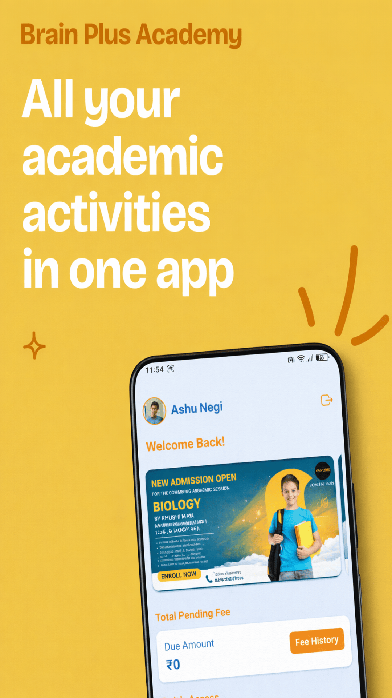
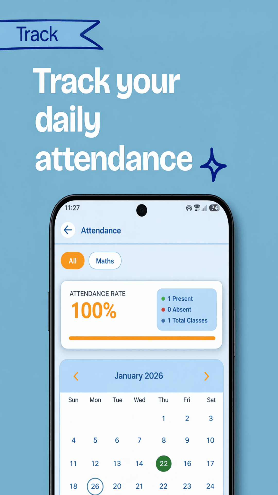
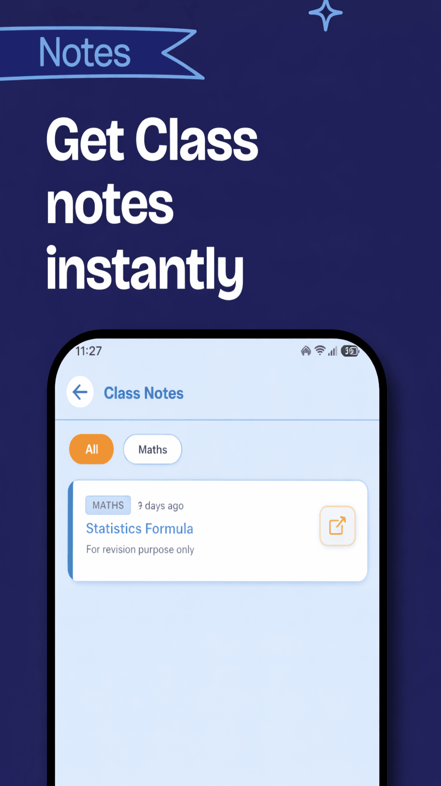
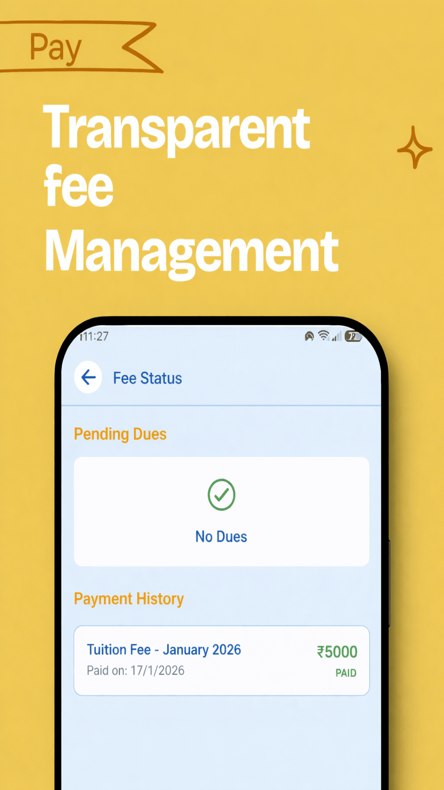

<div align="center">


Brain Plus Academy 🚀
=====================

**A Full-Stack, Multi-Role EdTech & Institute Management Platform**

</div>

📖 Overview
-----------

**Brain Plus Academy** is a comprehensive, scalable mobile application designed to digitize and streamline the operations of educational coaching institutes. Built with **React Native (Expo)** and powered by a **Firebase Serverless Backend**, the platform offers highly customized, role-based environments for Administrators, Teachers, and Students/Parents.

This project demonstrates end-to-end full-stack development, including secure authentication, real-time database syncing, cloud storage, serverless cloud functions, and push notifications.

* * * * *

🚀 Live Demo, App & Test Accounts
--------------------------------

🎥 **Watch Demo (Recommended First):**  
👉 https://youtu.be/4EBRw99I4TM?si=wFNR0Y0KxvYsU2ia  

<a href="https://play.google.com/store/apps/details?id=com.brainplus.academy" target="_blank">
    
</a>

You can explore the application using the following test credentials:

| **Role** | **Email** | **Password** | **Notes** |
| --- | --- | --- | --- |
| **Student** | `student@gmail.com` | `12345678` | Access to attendance, fees, and homework. |
| **Teacher** | `teacher@gmail.com` | `12345678` | Access to class management and salary slips. |

* * * * *

✨ Key Technical Highlights
--------------------------

-   **Robust Role-Based Access Control (RBAC):** Secure, dynamic routing system using Expo Router that restricts access and UI components based on authenticated user roles (`admin`, `teacher`, `student`, `guest`).

-   **Serverless Backend Architecture:** Utilizes Node.js Firebase Cloud Functions to handle privileged operations securely off-client, including account deletion requests and credential updates via the Admin SDK.

-   **Complex Data Modeling:** Relational-style queries in NoSQL (Cloud Firestore) to handle interrelated datasets like class-specific notices, fee ledgers, attendance arrays, and teaching schedules.

-   **Modern UI/UX & Theming:** Fully responsive, cross-platform UI built with **NativeWind** (TailwindCSS for React Native), featuring dynamic Dark/Light mode driven by Context API and Animated modal sheets.

-   **App Store Privacy Compliant:** Engineered to meet strict Apple App Store and Google Play Store privacy guidelines (COPPA/GDPR), featuring automated data retention policies and in-app self-service account deletion.

* * * * *

🛠️ Tech Stack
--------------

### Frontend

-   **Framework:** React Native / Expo

-   **Routing:** Expo Router (File-based routing)

-   **Styling:** NativeWind (Tailwind CSS)

-   **Icons & UI:** Expo Vector Icons, React Native Reanimated

-   **Image Handling:** Expo Image Picker

### Backend & Cloud (Firebase)

-   **Authentication:** Firebase Auth (Email/Password)

-   **Database:** Cloud Firestore (NoSQL)

-   **Storage:** Firebase Cloud Storage (Images, PDFs)

-   **Serverless:** Firebase Cloud Functions (Node.js)

-   **Notifications:** Firebase Cloud Messaging (FCM)

* * * * *

📱 Features by Role
-------------------

### 🛡️ Administrator Dashboard

-   **User Management:** Provision, verify, and manage Student and Teacher accounts.

-   **Financial Hub:** Track pending/paid student fees (with proof-of-payment verification) and manage teacher salary disbursements.

-   **Global Communication:** Broadcast targeted push notifications and notices (Global, Class-Specific, or Role-Specific).

-   **Content Moderation:** Oversee uploaded homework, study notes, and video lectures.

### 👨‍🏫 Teacher Dashboard

-   **Academic Management:** View assigned teaching schedules, log daily attendance, and upload class notes/assignments.

-   **Performance Tracking:** Submit and update test scores for enrolled students.

-   **HR & Payroll:** Track pending commission/fixed salaries and submit formal leave requests.

### 👨‍🎓 Student / Parent Dashboard

-   **Academic Tracking:** View real-time attendance percentages, homework assignments, and test results.

-   **Financial Transparency:** Monitor fee dues, view payment history, and securely upload payment receipts for admin verification.

-   **Self-Service Security:** Update profile media and manage login credentials securely within the app.

* * * * *

📸 Screenshots
--------------

*(Replace these links with actual screenshots from your `assets/screenshots` folder)*

| **Dashboard (Student)** | **Attendance Tracking** | **Secure Settings** | **Admin Finance** |
| --- | --- | --- | --- |
|  |  |  |  |

* * * * *

🚀 Getting Started
------------------

### Prerequisites

-   Node.js (v18+)

-   npm or yarn

-   Expo CLI

-   A Firebase Project with Auth, Firestore, Storage, and Functions enabled.

### 1\. Clone the repository

Bash

```
git clone https://github.com/igdevansh09/brain-plus.git
cd brain-plus

```

### 2\. Install dependencies

Bash

```
npm install

```

### 3\. Environment Setup

Create a `.env` file in the root directory with your Firebase project credentials (never commit this file):

Code snippet

```
EXPO_PUBLIC_FIREBASE_API_KEY=your_api_key
EXPO_PUBLIC_FIREBASE_AUTH_DOMAIN=your_auth_domain
EXPO_PUBLIC_FIREBASE_PROJECT_ID=your_project_id
EXPO_PUBLIC_FIREBASE_STORAGE_BUCKET=your_storage_bucket
EXPO_PUBLIC_FIREBASE_MESSAGING_SENDER_ID=your_messaging_sender_id
EXPO_PUBLIC_FIREBASE_APP_ID=your_app_id

```

### 4\. Deploy Cloud Functions

Bash

```
cd functions
npm install
firebase deploy --only functions

```

### 5\. Run the App

Bash

```
npx expo start

```

Scan the QR code with the Expo Go app on your physical device, or press `a` to run on an Android emulator / `i` for iOS simulator.

* * * * *

🗂️ Project Structure
---------------------

Plaintext

```
brain-plus/
├── app/                  # Expo Router file-based navigation
│   ├── (admin)/          # Admin-protected routes
│   ├── (teacher)/        # Teacher-protected routes
│   ├── (student)/        # Student-protected routes
│   └── (auth)/           # Authentication flows
├── components/           # Reusable UI components (Modals, Alerts, Headers)
├── config/               # Firebase & third-party initializations
├── context/              # React Context (Auth, Theme, Toast)
├── functions/            # Firebase Cloud Functions backend logic
├── utils/                # Helper functions (AuthHelpers, NotificationService, Colors)
└── assets/               # Images, fonts, and icons

```

* * * * *

<div align="center">

<i>Developed with ❤️ by <a href="[https://github.com/igdevansh09](https://www.google.com/search?q=https://github.com/igdevansh09)">Devansh Gupta</a></i>

</div>
